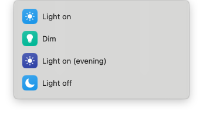

# Litra Glow

Control the Logitech Litra Glow light via the [Shortcuts app][shortcuts-app] on MacOS (and via the command-line).



## Acknowledgement

This script uses the [hidapitester][hidapitester] command-line program and the hex codes for the Litra Glow found in the [litra-driver][litra-driver] utility.

## Usage

Control the Litra Glow via the [Shortcuts app][shortcuts-app] or by using the command-line with the `litra-glow` command.

### Command-line

Depending on whether you added this directory to your `PATH` you can run the `litra-glow` command, else you will have to include the path to the script (e.g. `~/Developer/litra-glow-litra-glow`) or navigate to this directory and run `./litra-glow`.

The `litra-glow` command takes one or more options, for example:
```
litra-glow on
litra-glow on dim
litra-glow on warm bright
```

The available option are the following:
```
# Usage:        ./litra-glow [OPTIONS]
#   on|off           Turn the Litra Glow on or off.

#   glow             Set the brighness to 10%.
#   dim              Set the brighness to 20%.
#   normal           Set the brighness to 40%.
#   medium           Set the brighness to 60%.
#   bright           Set the brighness to 80%.
#   brightest        Set the brighness to 100%.

#   warmest          Set the colour temperature to 2700K.
#   warm             Set the colour temperature to 3000K.
#   mild             Set the colour temperature to 3500K.
#   neutral          Set the colour temperature to 4000K.
#   cool             Set the colour temperature to 5000K.
#   cold             Set the colour temperature to 5500K.
#   coldest          Set the colour temperature to 6500K.
```

## Install

1. [Download][download-link] or clone this repository.

2. Navigate to the litra-glow directory.

  ```
  cd /path/to/litra-glow
  ```

3. If the scripts are not executable, then you can make them executable by running the following command.

  ```
  chmod +x download_hidapitester litra-glow
  ```

4. Download the `hidapitester` command-line program to the current directory by running the following command.

  ```
  ./download_hidapitester
  ```

4. Import the shortcuts in the [Shortcuts app][shortcuts-app] from the shortcuts directory by double clicking them.

   > Note: after importing the shortcuts, you will have to edit each of them and update the path to the path where you have put the litra-glow directory.

5. Optionally add the litra-glow directory to your `PATH` to make `litra-glow` available as a command.

[shortcuts-app]: https://support.apple.com/guide/shortcuts-mac/welcome/mac
[hidapitester]: https://github.com/todbot/hidapitester
[litra-driver]: https://github.com/kharyam/litra-driver
[download-link]: https://github.com/ucomesdag/litra-glow/archive/refs/heads/main.zip
